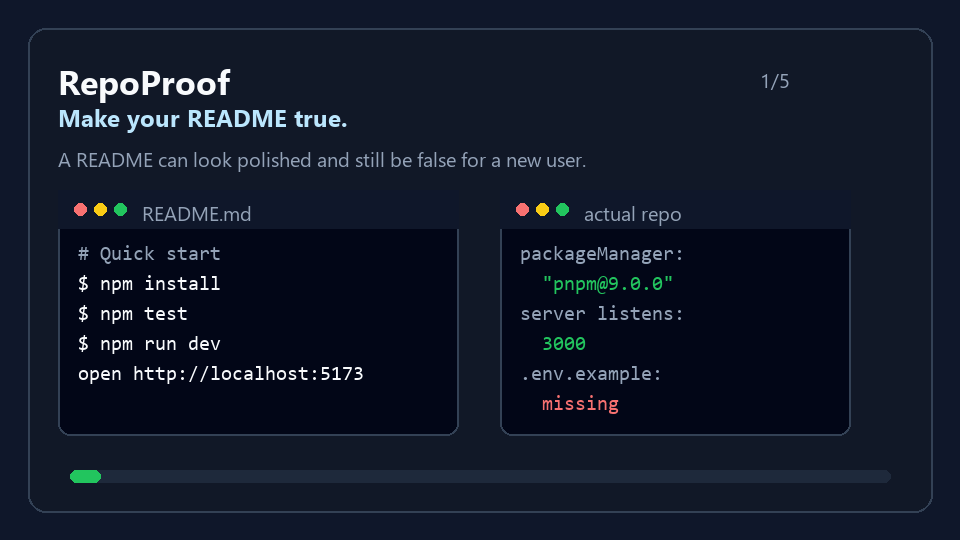

<p align="center">
  
</p>

# RepoProof

**Make your README true.**

RepoProof is an open Agent Skill and deterministic helper toolkit for proving that a repository can be installed, run, tested, and demonstrated from the public instructions a new user can see.

It treats `README.md` as a contract. It creates evidence, not vibes.

```text
repo-proof
  audit  -> find README, script, env, packaging, and safety drift
  prove  -> explicitly run the visible workflow in a cleanroom copy
  fix    -> generate minimal patches for documentation and configuration drift
```

## Why

CI proves that the maintainer's workflow runs. README generators write plausible documentation. Markdown code block testers execute isolated snippets.

RepoProof answers a different question:

> If a stranger clones this repository today and follows the README, does it actually work?

## Who should use it

RepoProof is for developers and maintainers who need the README to be true before other people depend on it:

- Open-source maintainers preparing a release or reviewing onboarding changes.
- Developers publishing a GitHub project after local-only or AI-assisted work.
- npm and PyPI package authors checking install, test, demo, and packaging instructions.
- Teams that want a repeatable preflight before making a repository public.

It is most useful when the project already works on your machine, but you are not sure a fresh clone can reproduce that path from the README alone.

## Install as an Agent Skill

RepoProof is a plain skill directory. The most reliable install path is to clone this repository into the skills folder your agent already reads.

### Codex

Project-local install:

```sh
mkdir -p .agents/skills
git clone https://github.com/Gary06868/repo-proof .agents/skills/repo-proof
```

Codex user-level install:

```sh
mkdir -p ~/.codex/skills
git clone https://github.com/Gary06868/repo-proof ~/.codex/skills/repo-proof
```

Then ask Codex:

```text
Use repo-proof to audit this repository README from a fresh clone.
```

### Claude Code

Project-local install:

```sh
mkdir -p .claude/skills
git clone https://github.com/Gary06868/repo-proof .claude/skills/repo-proof
```

Claude user-level install:

```sh
mkdir -p ~/.claude/skills
git clone https://github.com/Gary06868/repo-proof ~/.claude/skills/repo-proof
```

Then ask Claude Code:

```text
Use repo-proof to prove this README from a fresh clone.
```

### Other agents and `gh skill`

If your environment supports Open Agent Skills or `gh skill`, install RepoProof into the equivalent skill directory or run:

```sh
gh skill install Gary06868/repo-proof repo-proof
```

Compatible skill locations include `.agents/skills/repo-proof`, `~/.agents/skills/repo-proof`, `.codex/skills/repo-proof`, `~/.codex/skills/repo-proof`, `.claude/skills/repo-proof`, `~/.claude/skills/repo-proof`, `.cursor/skills/repo-proof`, `.github/skills/repo-proof`, and `.gemini/skills/repo-proof`.

## Three-minute first run

```sh
pnpm install
pnpm repoproof audit fixtures/node/wrong-package-manager --json --output .tmp/demo
```

Open `.tmp/demo/repoproof-report.md`.

To explicitly execute README commands:

```sh
pnpm repoproof prove fixtures/node/good-cli --allow-exec --json --output .tmp/proof
```

## Safety model

RepoProof defaults to `audit-only`. Audit mode does not run repository code.

`prove --allow-exec` runs README commands in a best-effort cleanroom copy with a reduced environment, timeouts, output limits, and report redaction. This is not a strong sandbox. Without a real container, VM, or OS sandbox, no tool can claim arbitrary unknown repositories are fully safe to execute.

RepoProof never publishes, deploys, pushes, merges, or reads user secrets.

## What RepoProof checks

- README install, test, run, demo, and packaging commands.
- Node package manager drift across README, lockfiles, and `packageManager`.
- Python version drift between README and `pyproject.toml`.
- Missing `.env.example`.
- Dangerous scripts such as `curl | bash`, lifecycle install hooks, and destructive commands.
- Missing files referenced by README commands.
- npm package file omissions.
- Local web demos that exit before becoming reachable.
- Windows-incompatible scripts.

## Outputs

- `repoproof-report.md`
- `repoproof-report.json`
- `repoproof-fixes.patch`
- `repoproof-action.yml`

See [reports/examples/before-after.md](reports/examples/before-after.md) for a compact before/after example.

## GitHub Action

```yaml
name: RepoProof
on: [pull_request, workflow_dispatch]
permissions:
  contents: read
jobs:
  repoproof:
    runs-on: ubuntu-latest
    steps:
      - uses: actions/checkout@<pinned-sha>
      - uses: Gary06868/repo-proof/action@v0.1.0
        with:
          mode: audit
          profile: baseline
          fail-on: error
          upload-artifact: true
```

## Fixtures and evals

The repository includes intentionally broken fixtures for Node, Python, and local web projects. Each fixture has deterministic expected findings.

```sh
pnpm test:fixtures
pnpm test:evals
pnpm test:baseline
```

## Release readiness

RepoProof includes release packaging checks for itself:

```sh
pnpm verify
pnpm release:dry-run
```

The release dry-run writes a self-audit report plus `SHA256SUMS`, `sbom.spdx.json`, and `release-manifest.json` under `.tmp/`. See [docs/release-checklist.md](docs/release-checklist.md).

## Demo



The capture script lives in [docs/demo-script.md](docs/demo-script.md). A static storyboard is also available at [assets/demo-storyboard.svg](assets/demo-storyboard.svg).

## Roadmap

v1 intentionally excludes Docker cleanrooms, Go/Rust/Java, multi-service orchestration, real registry publishing, and automatic push/merge/deploy.

## Privacy

RepoProof has no telemetry. Reports are generated locally and pass through a deterministic redaction layer for tokens, home paths, email addresses, and common secret variables.

## Chinese README

See [README.zh-CN.md](README.zh-CN.md).
